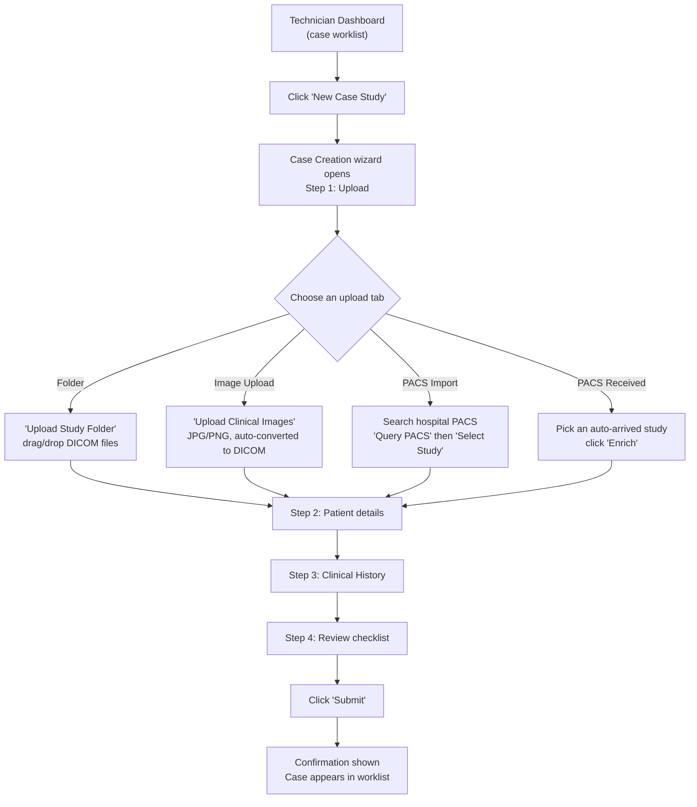
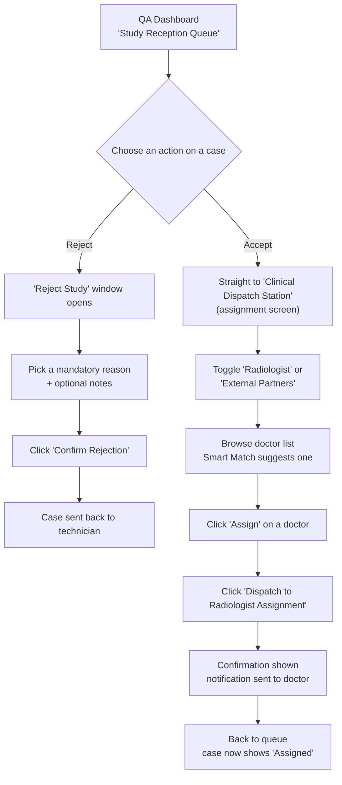
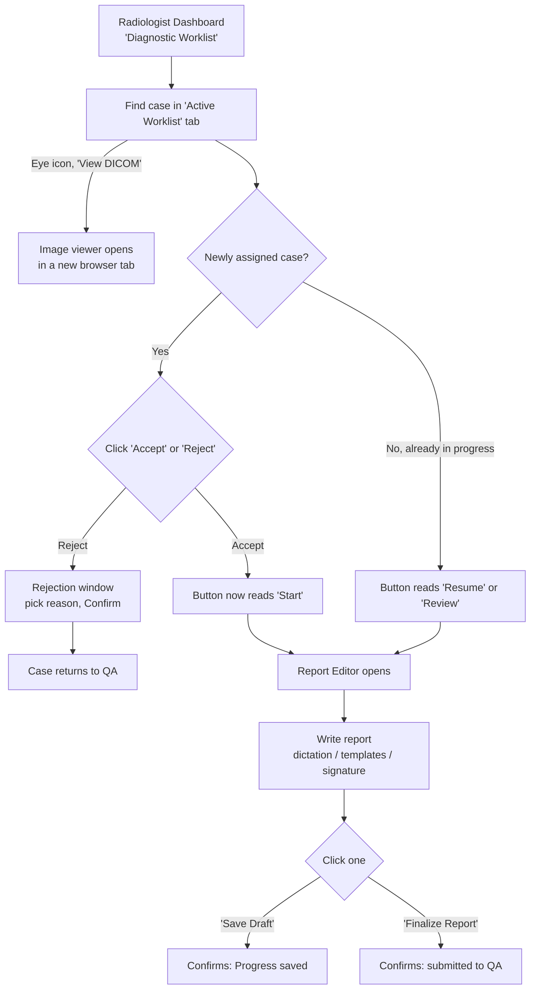
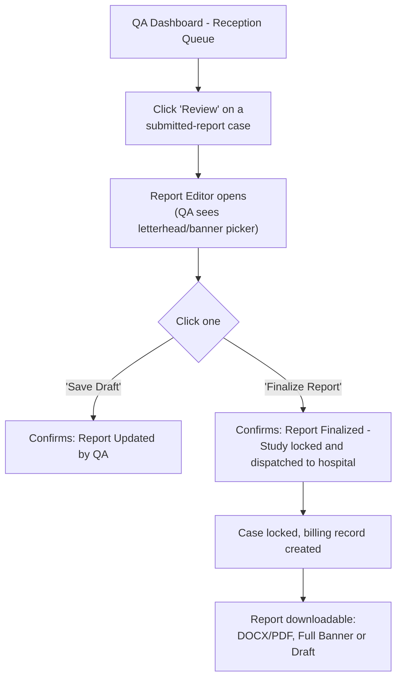
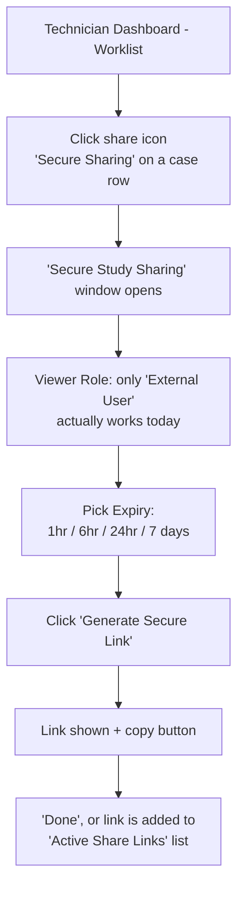
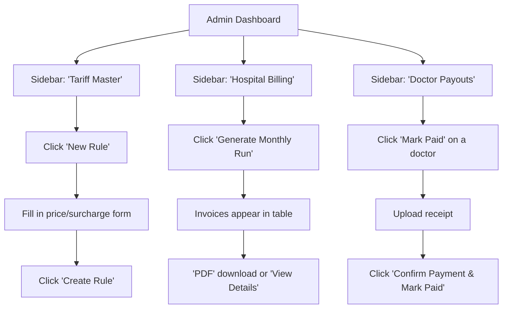
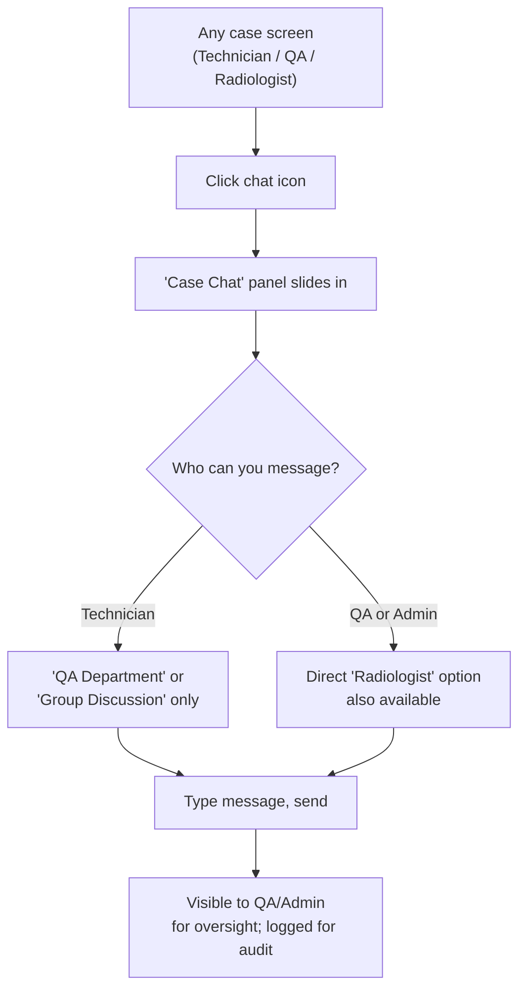
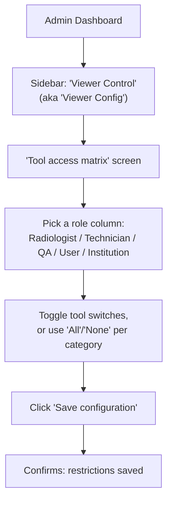

# Armorray — Verified User Flows

**How this document was built:** every screen name, button label, and tab name below was copied verbatim from the actual React source code (not guessed or inferred from older planning documents). Where the code didn't make something obvious, or where a screen described in older docs turned out not to actually be reachable by clicking anything in the current app, that's called out explicitly rather than guessed. See the **Appendix** at the end for a consolidated list of those gaps.

Flows 1–7 are the ones requested. Flow 8 (Admin: viewer tool permissions) was added because it directly explains a real security behavior flagged in the internal risk review, and it's a regularly-used admin screen.

---

## Flow 1 — Technician: Uploading a New Scan/Study

**Role:** Technician

1. **Technician Dashboard** (the case worklist) → click **"New Case Study"** (shown as **"New Case"** on mobile).
2. The **Case Creation** wizard opens — a 4-step process: **Upload → Patient → History → Review**.
3. On the **Upload** step, choose one of five tabs:
   - **Folder** — a drop zone titled *"Upload Study Folder"*; select a folder of DICOM files, and patient/scan details are read automatically from the files.
   - **Image Upload** — a drop zone titled *"Upload Clinical Images"*; accepts JPG/PNG only (these get converted into DICOM format automatically behind the scenes so they can be viewed alongside real scans).
   - **PACS Import** — search the hospital's own PACS system directly: type an ID, click **"Query PACS"**, then click **"Select Study"** on the result you want.
   - **PACS Received** — a list of studies that already arrived automatically (pushed directly from the hospital's scanner). Cards needing more information show a **"Needs Enrichment"** badge; click **"Enrich"** to fill in the missing details.
   - **PACS Export** — a separate action (not really "creating" a case) for sending a study *out* to another PACS system; its button reads **"Transmit to Remote PACS"**.
4. Step 2 — **Patient**: confirm/enter patient name, age, gender, referring doctor, etc.
5. Step 3 — **History**: add clinical history (one-click templates are available, e.g. "CT Brain – Stroke").
6. Step 4 — **Review**: a checklist confirms patient identity, technical parameters, clinical history, and that the full study was received.
7. Click **"Submit"**.
8. A confirmation message appears ("Upload complete," or "PACS Import started in background" for PACS Import mode), the wizard closes, and the case appears in the technician's worklist.

**Notes:**
- "PACS Export" lives inside the same modal but is a different action (sending a study out), not part of creating a new case.
- Sources: `CaseCreationModal.tsx`, `PacsReceivedPanel.tsx`, `features/dashboard/technician/index.tsx`.

---

## Flow 2 — QA: Reviewing and Routing a Study to a Radiologist

**Role:** QA

1. **QA Dashboard** → **"Study Reception Queue"** — every incoming case is listed here with an action button.
2. To reject a case: click **"Reject"** → a **"Reject Study"** window opens → pick one mandatory reason from a fixed list (*Motion Artifacts (Blurry), Missing Key Series/Planes, Poor Contrast Opacification, Wrong Patient ID/Name, Age/Sex Mismatch in Header, History Doesn't Match Study, Wrong Body Part Scanned*), optionally add notes → click **"Confirm Rejection"** → the case is sent back to the technician (they'll see a **"Fix Case"** option to correct and resubmit it).
3. To accept a case: click **"Accept"** → this moves straight into the **assignment screen** (see below).
   > ⚠️ **Important, verified in code:** clicking "Accept" does **not** currently show any separate identity-check or image-quality checklist screen, even though that kind of screen exists in the underlying code — it just isn't connected to this button today. Worth confirming with engineering whether that's intentional. See Appendix.
4. The **assignment screen** ("Clinical Dispatch Station") opens. Toggle between **"Radiologist"** and **"External Partners"**.
5. Browse the doctor list (search by name/sub-specialty; a "Recommended" badge marks the system's suggested doctor based on specialty/workload/turnaround-time). Click **"Assign"** next to a doctor.
6. Click the final button, which reads **"Dispatch to Radiologist Assignment"** (or "...Partner Assignment").
7. A confirmation appears ("Study Dispatched — notification sent to [doctor's name]"), and the case returns to the queue showing status **"Assigned."**

**Notes:**
- The QA rejection window is actually the same shared component used by radiologists to reject a case, with the same 7 reasons.
- Sources: `ReceptionQueue.tsx`, `AssignmentManager.tsx`, `DoctorDiscovery.tsx`, `RejectionModal.tsx`.

---

## Flow 3 — Radiologist: Opening a Study and Writing/Submitting a Report

**Role:** Radiologist

1. **Radiologist Dashboard** → **"Diagnostic Worklist"** → **"Active Worklist"** tab.
2. To **look at the actual scan images**: click the eye icon on the case row (its tooltip reads *"View DICOM"*) → this opens the separate medical image viewer in a **new browser tab**.
3. To **work on the report**: for a brand-new assignment, click **"Accept"** (or **"Reject"**, which opens the same rejection window described in Flow 2). Once accepted, the same button changes to read **"Start"** — and later, **"Resume"** or **"Review"** depending on progress.
4. Clicking Start/Resume/Review opens the **Report Editor** inside the dashboard (with a **"Back to Worklist"** button available at any time).
5. Inside the editor: optionally click **"Start Dictation"** to dictate the report by voice (button changes to "Recording..." while listening), **"Sync Patient Details"** to pull in patient info automatically, or **"Insert Signature"** (the first time, this opens an **"Upload Digital Signature"** window).
6. Write the findings/impression (templates and quick-expansion shortcuts are available in the sidebar).
7. Click **"Save Draft"** at any time (confirms "Progress saved successfully"), or click **"Finalize Report"** when done (confirms "Report finalized and submitted to QA").
8. Finalizing closes the editor, and the case moves on to QA for final review.

**Notes:**
- "Viewing the images" and "writing the report" are two separate, parallel actions — a radiologist typically has the image viewer open in one browser tab and the report editor open in the main app at the same time.
- Sources: `features/dashboard/radiologist/index.tsx`, `WorklistTable.tsx`, `ReportingEditor.tsx`, `SignatureModal.tsx`, `RejectionModal.tsx`.

---

## Flow 4 — Report Going Back Out to the Hospital

**Role:** QA (finalizes); Technician (can also see/download it)

1. **QA Dashboard** → **"Study Reception Queue"** → click **"Review"** on a case whose report has been submitted.
2. The same **Report Editor** used by radiologists opens (QA sees a hospital-letterhead/banner picker in the sidebar instead of templates).
3. QA can click **"Save Draft"** (confirms "Report Updated by QA") to make edits without finishing, or click **"Finalize Report"** when satisfied.
4. Finalizing shows the confirmation **"Report Finalized — Study locked and dispatched to hospital."** At this point the case is permanently locked (medico-legal lock) and a billing record is generated automatically.
5. The finished report becomes available to download in four formats from a dropdown: **"DOCX (Full Banner)," "PDF (Full Banner)," "DOCX (Draft – No Banner)," "PDF (Draft – No Banner)."**

**Notes:**
- ⚠️ **Needs manual verification:** the confirmation message literally says "dispatched to hospital," but what was confirmed in the code is that the case gets locked and the report becomes *downloadable* within the platform. Whether there's also an automatic outbound step (e.g., an email actually being sent, or a hospital-facing portal being auto-notified) was not confirmed — worth checking with engineering before describing this to a client as fully automatic delivery.
- Sources: `ReportingEditor.tsx`, `ReceptionQueue.tsx`, `features/dashboard/qa/index.tsx`.

---

## Flow 5 — Creating and Sending a "View-Only" Share Link

**Role:** Technician

1. **Technician Dashboard** → worklist → click the share icon on a case row (tooltip: *"Secure Sharing"*).
2. A **"Secure Study Sharing"** window opens.
3. Choose a **Viewer Role** — in the app as it stands today, **"External User" is the only option that actually works**; other role choices exist in the underlying code but are switched off.
4. Choose an **Expiry**: 1 Hour, 6 Hours, 24 Hours, or 7 Days.
5. Click **"Generate Secure Link."**
6. A confirmation panel ("New Link Generated") shows the link with a copy button. Click **"Done,"** or the link is added to a running **"Active Share Links"** list, where it can be copied again or revoked at any time.

> ### ⚠️ Important — this does NOT currently behave as strictly "view-only"
> This matches what's flagged in the internal risk review. Two things were confirmed directly in the code:
> 1. **The share-link screen itself never says "view-only" anywhere** — there's no on-screen promise about what the recipient can or can't do. What they can actually do is controlled entirely behind the scenes.
> 2. **The system that's supposed to restrict what tools a shared link's viewer sees has a "show everything if nothing is explicitly configured" behavior** — the Admin's own tool-permission screen (Flow 8) literally warns that if no tools are selected for a role, *all* tools are shown by default. Whether the "External User" role currently has a safe, minimal tool list configured needs to be checked directly in Admin → Viewer Control before this is described to a client as guaranteed view-only.
>
> **Recommendation:** before offering this feature to a client as "view-only," have someone check the current "External User" row in Admin → Viewer Control and confirm it's actually locked down to view-only tools.

**Sources:** `ShareModal.tsx`, `StudyTable.tsx`.

---

## Flow 6 — Billing-Related Actions

**Roles:** Admin (does the real, regular billing work); Radiologist (views own earnings, read-only)

> ⚠️ **Correction to earlier assumptions:** a technician-facing billing screen (`BillingView.tsx`) and a full "identity/quality verification" flow do exist in the code, but the billing screen is **not currently connected to anything a technician can click** — it isn't part of the live app today. QA has no billing screen at all. The real, working billing actions all live in the **Admin** dashboard.

**6a. Setting a price (Tariff):**
1. **Admin Dashboard** → sidebar → **"Tariff Master."**
2. Click **"New Rule."**
3. Fill in the **"Create New Tariff Rule"** form: Modality, Study/Procedure, Base Price plus Emergency/Night surcharges (in INR), an Active toggle, and optionally scope it to a specific hospital or radiologist.
4. Click **"Create Rule."** (A **"Bulk Import"** button next to "New Rule" allows uploading many tariffs at once via JSON/Excel.)

**6b. Generating a hospital invoice:**
1. **Admin Dashboard** → sidebar → **"Hospital Billing."**
2. Click **"Generate Monthly Run."** *(Note: this generates invoices for the current calendar month only — there's no date-range picker yet.)*
3. Invoices appear in a table; click **"PDF"** to download one, or **"View Details"** to see the breakdown. Clicking the payment-status badge directly toggles it between Paid/Pending.

**6c. Paying a radiologist:**
1. **Admin Dashboard** → sidebar → **"Doctor Payouts."**
2. Click **"Mark Paid"** on a radiologist's row → a **"Process Payout"** window opens → upload a receipt → click **"Confirm Payment & Mark Paid."** (A **"Bulk Monthly Batch"** option exists for processing many payouts for a chosen month/year at once.)

**6d. A radiologist checking their own earnings:**
1. **Radiologist Dashboard** → wallet icon in the sidebar → **"Revenue Ledger"** screen, showing total unbilled earnings and a monthly payout-statement history with downloadable receipts/invoices.

**Sources:** `PricingManager.tsx`, `TariffModal.tsx`, `InvoiceList.tsx`, `PayoutManager.tsx`, `EarningsHistory.tsx`.

---

## Flow 7 — Real-Time Chat

**Roles:** Technician, QA, Radiologist, Admin — but who each role can message directly is different.

1. From a case, click the chat icon (tooltip *"Communication"* for a technician, *"Messenger"* for a radiologist) — a **"Case Chat"** panel slides in.
2. **If you're a Technician:** you can only start a conversation with **"QA Department"** or a **"Group Discussion."** There is no direct one-to-one option to message the assigned radiologist.
3. **If you're QA or Admin:** you additionally get a direct option to message the **Radiologist** one-to-one.
4. Type a message and send it. Everyone currently online for that case (Technician/Radiologist/QA) shows as a presence indicator in the panel header.
5. All messages are stored and visible to QA/Admin for oversight, and logged for audit — this is by design, not a leak.

**Sources:** `CaseChatHub.tsx`, `features/dashboard/technician/index.tsx`, `features/dashboard/radiologist/index.tsx`.

---

## Flow 8 (added) — Admin: Configuring Which Viewer Tools a Role Can Use

**Role:** Admin

*Why this is included:* this screen is the direct, working implementation behind the "role-based tool restriction" feature described in the platform overview, and it's directly relevant to the Flow 5 caution above.

1. **Admin Dashboard** → sidebar → **"Viewer Control"** *(the same screen is also linked from the dashboard's quick-access grid, but labeled **"Viewer Config"** there — two different names for one screen)*.
2. The screen's own title reads **"Tool access matrix."**
3. Tools are grouped into five categories (**Navigation, Measurements, Image Controls, Inspection & Analysis, Viewport Menus**), shown against five role columns (**Radiologist, Technician, QA, User, Institution**).
4. Toggle individual tool switches per role, or use the **"All"/"None"** buttons for a whole category, or the **"Enable all tools"/"Disable all tools"** buttons for a whole role column.
5. Click **"Save configuration"** (only enabled once something's changed — an "Unsaved changes" indicator shows beforehand).
6. A confirmation appears: **"Viewer restrictions saved successfully."**

> ### ⚠️ This screen tells you, in its own words, how it fails
> The screen displays this exact on-screen text: *"How it works: Only checked tools are visible in the Armorray Viewer for each role. If no tools are selected, all tools are shown by default (fail-open). Changes take effect on the next viewer session."*
>
> In other words, **an unconfigured or emptied-out role shows every tool, not none.** This is a broader version of the Flow 5 caution above, and it's the app's own admin screen saying so — not an inference.

**Sources:** `AdminSidebar.tsx`, `features/dashboard/admin/index.tsx`, `ToolControlConsole.tsx`.

---

## Appendix — Screens/Buttons That Exist in the Code but Don't Currently Work as Older Docs Describe

These were found while tracing the flows above. None of these are guesses — each is a component that exists in the source but isn't wired to anything a user can actually click today, or has some other confirmed inconsistency.

| Screen/Component | What it was supposed to do | What's actually true today |
|---|---|---|
| `VerificationView.tsx` / `IdentityComparison.tsx` / `QualityChecklist.tsx` | A dedicated identity-check and image-quality checklist for QA before approving a case (described in `QA.MD`) | Not reachable — clicking "Accept" in the Reception Queue skips straight to doctor assignment, bypassing this screen entirely. |
| `features/technician/components/BillingView.tsx` | A billing summary screen for technicians | Fully built, but not connected to any tab/button — a technician cannot currently see this screen. |
| `features/technician/components/SecureChat.tsx` | An earlier chat component | Unused; contains hardcoded demo/placeholder data. The real, active chat is `CaseChatHub`. |
| `AssignRadiologistModal.tsx` | Manual radiologist assignment | Only used from the **Admin** "Browse Studies" screen — a technician never sees this. |
| `ReportVerification.tsx`, `MetadataPanel.tsx` | A separate report sign-off screen with "Edit Report" / "Return for Correction" / "Final Approve & Dispatch" buttons | Not imported/used anywhere in the app. |
| `ReturnCorrectionModal` | Sending a report back to the radiologist for correction, separately from a full rejection | Rendered in the QA dashboard's code, but nothing ever opens it — no button currently triggers it. |
| Technician's own case-details modal | Viewing full case info from the technician side | Possibly unreachable — no button was found that opens it (QA's equivalent "Edit Details" button does work). Recommend a quick manual click-test to confirm either way. |
| Radiologist "Last 15 Days" / "Lifetime" buttons (Performance Analytics) | Filter the performance charts by time period | Present on screen but not wired to anything — clicking them does nothing. |
| Radiologist Worklist status filter dropdown | Filter cases by status | The dropdown's options ("Pending Assignment," "Accepted / Active," "Reported") don't match the real case-status list used everywhere else in the app — likely stale/leftover filter options. |
| Admin's PACS Vault screen has its own, separate "open in viewer" button | Same image-viewer launch as everywhere else | Uses a different, hardcoded local address and a different link format than the one used on the Radiologist dashboard — would likely break once deployed to a real server unless it's specifically fixed. |
| Assignment screen's footer note | Claims "Assignment triggers an immediate encrypted hand-off via WhatsApp and SMS node." | Given other confirmed findings (WhatsApp notifications are an unbuilt to-do item elsewhere in the backend), this on-screen claim should be treated as unverified/likely aspirational rather than a working feature, until specifically confirmed. |
